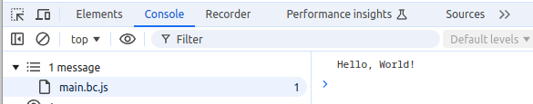
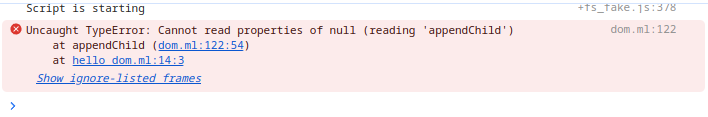

Source material:
================

https://discuss.ocaml.org/t/it-there-a-tutorial-for-js-of-ocaml-with-simple-graphics/4636/7

In particular:
 - https://hackmd.io/@Swerve/HyhrqnFeF

Setting up project scaffolding
===============================

Assumption: you have opam installed, that's where we start.

Step 1: create a local switch

```
opam switch create .
eval $(opam env)
```

Step 2: install dune

```
opam install dune
```

Step 3: create dune project scaffold

```
dune init proj jsoo_tut
```

Step 4: install jsof_ocaml

```
opam install js_of_ocaml js_of_ocaml-ppx js_of_ocaml-lwt
```

Hello World
============

We are starting with the basic hello world that was generated by `dune init proj ...`.

This is a basic 'hello world' app that just prints out 'Hello World' on the terminal
when executed. The code for it is in `bin/main.ml` and looks like this:

```
let () = print_endline "Hello, World!"
```

To avoid confusing different 'versions' of our app as we progress. I have
renamed this to `hello_console.ml`.

To support js_of_ocaml we modified the `bin/dune` file as follows:

```
(executable
 (public_name hello_console)
 (modes js exe)
 (preprocess (pps js_of_ocaml-ppx))
 (name hello_console)
 (libraries jsoo_tut js_of_ocaml js_of_ocaml-lwt))
```

Building and Running
=====================

To 'build everything':

```
dune build
```

This generates a 'standard' executable here:

```
_build/install/default/bin/hello_console
```

Run it like so:

```
$ ./_build/install/default/bin/hello_console
Hello, World!
```

You can also run it using `dune exec`:

```
$ dune exec bin/hello_console.exe
Hello, World!                 
```

It also generates a js file here:

```
_build/default/bin/hello_console.bc.js
```

You can run this using nodejs:

```
$ node _build/default/bin/hello_console.bc.js
Hello, World!
```

Running in a Browser and using Dom
==================================

Now that we have some 'scaffold' to build things, let's start following along the
lines of the tutorial from here: https://hackmd.io/@Swerve/HyhrqnFeF

We need a html file that can be loaded in a browser and loads our 'js' file.

Create a directory for html files:

```
$ mkdir html
```

Add a `hello_console.html` with this contents:

```
<html>
  <head>
    <title>Jsoo_intro</title>
    <script type="text/javascript" src="../_build/default/bin/hello_console.bc.js"></script>
  </head>
  <body>
  </body>
</html>
```

You can open this file in Chrome to 'run' it. For example on Unix and assuming we use Chrome
as our default browser we can do:

```
$ xdg-open html/hello_console.html
```

And it will open the page. Note: at this point it will just display a blank page as there is
nothing actually on the page. The script that is being loaded and executed just 
prints something onto the console. You can open "Chrome Dev Tools" and look for "Console output" to check whether it worked:



Using DOM in the Browser
========================

In a web-page, to show information to the user you wouldn't really print messages
onto the console (that's useful for debugging output however). Instead you
would modify the 'DOM' representing the page content.

Before we start modifying the `hello_console.ml` example we'll make a copy into
`hello_dom.ml` (so we can keep both versions in the final git repo of this tutorial).

```
$ cp bin/hello_console.ml bin/hello_dom.ml
```

We also update the `bin/dune` file:

```
(executable
 (public_name hello_dom)
 (modes js exe)
 (name hello_dom)
 (preprocess (pps js_of_ocaml-ppx))
 (libraries jsoo_tut js_of_ocaml js_of_ocaml-lwt))
```

Note: I also kept the `hello_console` executable stanza in comments. I wish I could
have kept them both active at the same time but it looks like they somehow conflict 
with eachother.

Now let's change the `hello_dom.ml` so it adds a "Hello Dom World!" pararagraph to the
dom.

```
module Html = Js_of_ocaml.Dom_html
module Js = Js_of_ocaml.Js
module Dom = Js_of_ocaml.Dom

let doc = Html.document

let para txt =
  let el = Html.createP doc in
  Dom.appendChild el (doc##createTextNode (Js.string txt));
  el

let () = 
  print_endline "Script is starting";
  Dom.appendChild doc##.body (para "Hello Dom World!")
```

Let's examine some interesting bits and pieces more closely. We start by creating
some convenient aliases for some of the `Js_of_ocaml` library modules:

```
module Html = Js_of_ocaml.Dom_html
module Js = Js_of_ocaml.Js
module Dom = Js_of_ocaml.Dom
```

Generally you can find docs for these modules on [ocaml.org](https://ocaml.org/packages). For example [here](https://ocaml.org/p/js_of_ocaml/5.9.0/doc/Js_of_ocaml/Js/index.html) is a good entrypoint to the `Js` module docs.

These modules provide bindings and utility functions to work with browser apis and 
"the JavaScript World". The docs are sort of helpful but can be quite confusing.

An important thing to understand is that Ocaml and JavaScript are kind of 'separate
worlds' and the values that live in those two different worlds have different types. 
For example an Ocaml `bool` is different from a JavaScript boolean, and an Ocaml `string` 
is different from a JavaScript string; you can't just use them interchangeably.
The `Js` module is key here and provides functions and type declarations for
keeping values from the two worlds separate from one another and converting between them.

For a concrete example let's have a look at the `para` function in our example. This accepts
a `string` value and creates `<p>` Html/Dom element from it:

)

Looking at its type `string -> Html.paragraphElement Js.t` is interesting (FYI: in the screenshot you can see its inferred type displayed as a 'codelens' inside Vscode [Ocaml Platform](https://marketplace.visualstudio.com/items?itemName=ocamllabs.ocaml-platform)).

As you can see it accepts one parameter of type `string` (this is a 'plain' Ocaml string) and returns a thing of
type `Html.paragraphElement Js.t`. The `Js.t` indicates that this is "A type from the JavaScript world", rather
than a "plain Ocaml type". Even within the "JavaScript World" `Js_of_Ocaml` provides a rich type system to keep
track of different types of things. In this case the return can be seen to represent a `paragraphElement` which 
is a specific type of element you can insert into a Dom tree.

Let's take a look at some of the other library functions used here as well as their types (Tip: if you have
Ocaml Platform setup properly, you can hover over each of them in the VScode editor and see their
types in a hover).

The function `Js.string` has type `string -> Js.js_string Js.t`. In short, this function accepts a Ocaml `string`
and converts it to a JavaScript string. Look at the details of the return type which are interesting 
`Js.js_string Js.t`. Once more we see the `Js.t` which essentially says "A type from the JavaScript world", and 
specifically a `Js.js_string`, so a string.

The function `Dom.appendChild` has type `#Dom.node Js.t -> #Dom.node Js.t -> unit`. Once again
we see the use of `Js.t` to indicate that this function accepts values "from the Javascript World", and
specifically it accepts two `#Dom.node`s as paramemters. This is a helper function that will append the
second node as a child of the first one. This function is called for its side effect (it modifies the
first node's state to add a child), so it returns `unit`)

Some other interesting things to look at in this code is the use of the `##` and `##.` operators.
This is a convenience syntax introduced and supported by the `(preprocess (pps js_of_ocaml-ppx))` line
in our `dune` file (this is a preprocessor provided by `Js_of_ocaml`). The `##` syntax provides 
a convenient syntax to call methods on `Js.t` objects. And similarly the
`##.` syntax allows accessing or overwriting (when used in combination with `:=`) properties 
in `Js.t` objects.

For example `doc##createTextNode` references a method called `createTextNode` in the `doc` variable (which
holds a referece to `Html.document js.t` value).

Similarly `doc##.body` references a `body` property in the same `doc` object.

## Build and Run The Dom Example

You can now build and run in the same way as the console example:

```
$ dune build
$ xdg-open html/hello_dom.html
```

However, you'll run into a problem. The page remains blank and we see an error in Js console:



If you have some experience with Js in the browser you may be able to guess that the
problem is caused by executing our code before the dom was loaded. Our reference to `doc##.body`
was `null` causing this error. This happens because our code is running too early before the
dom was parsed (so the `document.body` doesn't exist yet).

One easy way to solve this is to add the `defer` attribute to our script tag in the html file.
This attribute tells the browser not to execute the script until the dom was fully parsed.

```
<script type="text/javascript" src="../_build/default/bin/hello_dom.bc.js" defer></script>
```

Another and perhaps more conventional way to deal with this would be explicitly ensure the correct
timing in JavaScript (or in our case in Ocaml :-) by registering an `onLoad` event handler.


