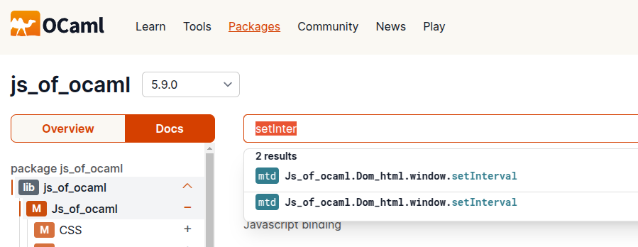

Js_of_ocaml Tutorial:
=====================

This tutorial walks through an example starting a `Js_of_ocaml` very simple web application.

It was heavily inspired by https://hackmd.io/@Swerve/HyhrqnFeF (see also https://discuss.ocaml.org/t/it-there-a-tutorial-for-js-of-ocaml-with-simple-graphics/4636/7)

The 'application' we are building is very similar:
 - hello world app displaying a message in the browser
 - adding a counter that updates every second.
 - adding a 'reset' button to reset the counter.

How this is different from the tutorial it is based on: 
- We will not be using the `Graphics` library to draw things in a canvas. Instead we'll use more  
  low-level `Js_of_ocaml` library apis to directly manipulate the dom.
- We'll also delve a little deeper into the steps the setup your project build files and 'IDE'
  to edit, build and run your code. I find that this often gives me more troubles than 
  understanding the actual Ocaml code in these kinds of examples, so I decided to
  write down the steps as I figured them out.

## Setting up project scaffolding

We'll start by setting up a project structure with `opam` and `dune` so we can run and
build our app.

Assumption: you already have [opam installed](https://opam.ocaml.org/doc/Install.html), that's where we start.

Step 1: create a local switch

```
opam switch create .
eval $(opam env)
```

Step 2: install dune

```
opam install dune
```

Step 3: create dune project scaffold

```
dune init proj jsoo_tut
```

Step 4: install jsof_ocaml

```
opam install js_of_ocaml js_of_ocaml-ppx js_of_ocaml-lwt
```

## Setting up your IDE

I recommend you use vscode for editing and that you install [Ocaml Platform Vscode Extension](https://marketplace.visualstudio.com/items?itemName=ocamllabs.ocaml-platform). 

See [here](https://ocaml.org/docs/configuring-your-editor) for detailed instructions.

TLDR; Besides the vscode extension you also need to install the `ocaml-lsp-server`:

```
opam install ocaml-lsp-server ocamlformat
```

## Hello World (cli/console)

We are starting with the basic hello world that was generated by `dune init proj ...`.

This is a basic 'hello world' app that just prints out 'Hello World' on the terminal
when executed. The code for it is in `bin/main.ml` and looks like this:

```
let () = print_endline "Hello, World!"
```

To avoid confusing different 'versions' of our app as we progress. I have moved
and renamed this to `01_hello_console/hello_console.ml`.

We also moved the `bin/dune` to `01_hello_console` and modified it to support 
`js_of_ocaml` as follows:

```
(executable
 (public_name hello_console)
 (modes js exe)
 (preprocess (pps js_of_ocaml-ppx))
 (name hello_console)
 (libraries jsoo_tut js_of_ocaml js_of_ocaml-lwt))
```

Building and Running
=====================

To 'build everything':

```
dune build
```

This generates a 'standard' executable here:

```
_build/install/default/bin/hello_console
```

Run it like so:

```
$ ./_build/install/default/bin/hello_console
Hello, World!
```

You can also run it using `dune exec`:

```
$ dune exec 01_hello_console/hello_console.exe
Hello, World!                 
```

It also generates a js file here:

```
_build/default/01_hello_console/hello_console.bc.js
```

You can run this using nodejs:

```
$ node _build/default/01_hello_console/hello_console.bc.js
Hello, World!
```

Running in a Browser and using Dom
==================================

Now that we have some 'scaffold' to build things, let's start actually making this
into a 'browser/html/js app'.

First, we'll need a html file that can be loaded in a browser and loads our 'js' file.
It doesn't really matter what we call this file or where we put it now, so let's
just put it alongside the `hello_console.ml` file, in the same directory, and call
it `hello_console.html`. Add this contents:

```
<html>
  <head>
    <title>Jsoo_intro</title>
    <script type="text/javascript" src="../_build/default/01_hello_console/hello_console.bc.js"></script>
  </head>
  <body>
  </body>
</html>
```

You can open this file in Chrome to 'run' it. For example on Unix and assuming we use Chrome
as our default browser we can do:

```
$ xdg-open 01_hello_console/hello_console.html
```

This will open the page. Note: at this point it will just display a blank page as there is
nothing actually on the page. The script that is being loaded and executed just 
prints something onto the console. You can open "Chrome Dev Tools" and look for "Console output" to check whether it worked:


## Using DOM in the Browser

In a web-page, to show information to the user you wouldn't really print messages
onto the console (that's useful for debugging output however). Instead you
would modify the 'DOM' representing the page content.

### Using 'dune' to install our js and html files

Before we start modifying the `hello_console.ml` example we'll make a copy of it
(so we can keep both versions in the final git repo of this tutorial). 

While we are at it, we will also change the `dune` file and remove the `public` name
for our executable, since it really doesn't serve a purpose (you cannot run the 'dom' version
of the example as a standalone executable since it depends on some JavaScript functions which
simply are not available when running a Ocaml binary executable).

```
$ cp -R 01_hello_console 02_hello_dom
```

Next we rename all files in the directory fron `hello_console*` to `hello_dom*` 
and make similar name changes in the `dune` file.

The dune file is now:

```
(executable
 (modes js exe)
 (name hello_dom)
 (preprocess (pps js_of_ocaml-ppx))
 (libraries jsoo_tut js_of_ocaml js_of_ocaml-lwt))
```

Now we add some `install` stanzas to install our `hello_dom.html` and `hello_dom.bc.js` files 
into the `docs/example` directory. Finally our `dune` file looks like this:

```
(executable
 (modes js exe)
 (name hello_dom)
 (preprocess (pps js_of_ocaml-ppx))
 (libraries jsoo_tut js_of_ocaml js_of_ocaml-lwt))

(install
  (section doc)
  (files (hello_dom.bc.js as examples/hello_dom.bc.js)))

(install
  (section doc)
  (files (hello_dom.html as examples/hello_dom.html)))
```

Now, when we `dune build` it will not place a `hello_dom` executable into the install directory
anymore, instead it will place our `.html` and `.bc.js` files into the `docs` install section.

So from now on this is how we build and open it:

```
$ dune build
$ xdg-open _build/install/default/doc/jsoo_tut/examples/hello_dom.html
```

Now let's change the `hello_dom.ml` so it adds a "Hello Dom World!" pararagraph to the
dom.

```
module Html = Js_of_ocaml.Dom_html
module Js = Js_of_ocaml.Js
module Dom = Js_of_ocaml.Dom

let doc = Html.document

let para txt =
  let el = Html.createP doc in
  Dom.appendChild el (doc##createTextNode (Js.string txt));
  el

let () = 
  print_endline "Script is starting";
  Dom.appendChild doc##.body (para "Hello Dom World!")
```

Let's examine some interesting bits and pieces more closely. We start by creating
some convenient aliases for some of the `Js_of_ocaml` library modules:

```
module Html = Js_of_ocaml.Dom_html
module Js = Js_of_ocaml.Js
module Dom = Js_of_ocaml.Dom
```

Generally you can find docs for these modules on [ocaml.org](https://ocaml.org/packages). For example [here](https://ocaml.org/p/js_of_ocaml/5.9.0/doc/Js_of_ocaml/Js/index.html) is a good entrypoint to the `Js` module docs.

These modules provide bindings and utility functions to work with browser apis and values
from "the JavaScript World". The docs are sort of helpful but they can be quite confusing.

An important thing to understand is that Ocaml and JavaScript are really 'separate
worlds' and the values that live in those two different worlds have different types. 
For example an Ocaml `bool` is different from a JavaScript boolean, and an Ocaml `string` 
is also different from a JavaScript string; you can't just use them interchangeably.
The `Js` module is key here and provides functions and type declarations for
keeping values from these two worlds separate from one another and converting between them.

For a concrete example let's have a look at the `para` function in our example. This accepts
a `string` value and creates `<p>` Html/Dom element from it:


Looking at its type `string -> Html.paragraphElement Js.t` is interesting (FYI: in the screenshot you can see its inferred type displayed as a 'codelens' inside Vscode [Ocaml Platform](https://marketplace.visualstudio.com/items?itemName=ocamllabs.ocaml-platform)).

As you can see it accepts one parameter of type `string` (this is a 'plain' Ocaml string) and 
returns a thing of type `Html.paragraphElement Js.t`. The `Js.t` indicates that this is 
"A type from the JavaScript world", rather than a "plain Ocaml type". Even within the 
"JavaScript World" `Js_of_Ocaml` provides a rich type system to keep track of different 
types of things. In this case the return type represents a `paragraphElement` which 
is a rather specific type of element (a `<p>` element is just one of many kinds of
things you can insert into a Dom tree).

Let's take a look at some of the other library functions used here as well as their types 
(Tip: if you have Ocaml Platform setup properly, you can hover over each of them in the 
VScode editor and see their types in a hover. Personally I find this extremely helpful
when trying to work with unfamiliar library apis, or even familiar ones :-)

The function `Js.string` has type `string -> Js.js_string Js.t`. In short, this function 
accepts a Ocaml `string` and converts it to a JavaScript string. Look at the details of 
the return type which are interesting: `Js.js_string Js.t`.  Once more we see the `Js.t` 
which essentially says "This is a type from the JavaScript world", and 
specifically a `Js.js_string`, so more specifically it is a JavaScript string.

The function `Dom.appendChild` has type `#Dom.node Js.t -> #Dom.node Js.t -> unit`. Once again
we see the use of `Js.t` to indicate that this function accepts values "from the Javascript World", and
specifically it accepts two `#Dom.node`s as paramemters. This is a helper function that will append the
second node as a child of the first one. This function is called for its side effect (it modifies the
first node's state to add a child), so it returns `unit`)

Some other interesting things to look at in this code is the use of the `##` and `##.` operators.
This is a convenience syntax introduced and supported by the `(preprocess (pps js_of_ocaml-ppx))` line
in our `dune` file (this is a preprocessor provided by `Js_of_ocaml`). The `##`  is a convenient syntax to call methods on `Js.t` objects.

For example `doc##createTextNode` references a method called `createTextNode` in the `doc` variable (which holds a referece to a `Html.document js.t` value).

Similarly `##.` is syntax for accessing or overwriting (when used in combination with `:=`) properties 
in `Js.t` objects. For example `doc##.body` references a `body` property in the `doc` object.

## Build and Run The Dom Example

You can now build and 'run' the example:

```
$ dune build
$ xdg-open _build/install/default/doc/jsoo_tut/examples/hello_dom.html
```

However, you'll run into a problem. The page remains blank and we see an error in Js console:


If you have some experience with Js in the browser you may be able to guess that the
problem is caused by executing our code before the dom was loaded. Our reference to `doc##.body`
was `null` causing this error. This happens because our script code is running too early before the
dom was parsed (so the `document##.body` is still `null`).

One easy way to solve this is to add the `defer` attribute to our script tag in the html file.
This attribute tells the browser not to execute the script until the dom was fully parsed.

```
<script type="text/javascript" src="../_build/default/bin/hello_dom.bc.js" defer></script>
```

## Event Handlers (for 'onload' event)

Another and perhaps more conventional way to deal with this would be to explicitly ensure 
the correct timing in JavaScript (or in our case in Ocaml :-) by registering an `onLoad` 
event handler. Normally I'd probably choose to use the `defer` attribute because its
a simpler solution. But using the `onload` instead gives us some more opportunities to
learn about the `Js_of_ocaml` libraries and how they 'bind' that kind of api, so let's
do that instead.

First we extract the code that adds the "Hello World!" message to the dom into a
separate function, so we can later attach it as a 'handler' for the `onload` event:

```
let on_load () =
  print_endline "on_load ...";
  Dom.appendChild doc##.body (para "Hello Dom World!")
```

Attaching it to the onload event is done by using the `window` object from JavaScript.
For convenience we assign it to a ocaml variable, similar to what we did
for the `document` object:

```
let doc = Html.document
let window = Html.window
```

Here's how we attach our `on_load` function as onload handler to the `window` object:

```
  window##.onload := Dom.handler (fun (_) -> on_load (); Js._true)
```

Reading this code, you can probably understand
it intuitively. However getting there was a little tricky for me so it might be
helpful to walk through the non-obvious 'discovery process'.

First, if you are familiar with JavaScript browser api you probably could have
guessed we need something like `window.onload` (in JavaScript syntax). For 
example, you can easily find something like [this explanation](https://www.squash.io/how-to-use-window-onload-in-javascript/),
which tells you to do something like:

```javascript
    window.onload = function() {
        // Code to be executed after the page has loaded
        console.log("Page loaded!");
    };
```

But how do we 'convert' that into `Js_of_ocaml`? We already found the `Html.window` object
so that is a good start. As usual in Ocaml, types can be very helpful in figuring out
what something is... and what you can do with it. When hovering over `Html.window` in
the editor we can see the type is `Html.window Js.t`. We should be starting to get
a little familiar with this already. Again we have `Js.t` meaning this is a "value from
JavaScript world", and specifically it is of type `Html.window`.

The content assist in the editor can also be helpful since the editor (or more accurately,
the Ocaml Language Server) knows the type of our `window` variable. We may suspect
that `window` has a 'onload' property or method. (This is true in fact, we can find the
doc here: https://ocaml.org/p/js_of_ocaml/5.9.0/doc/Js_of_ocaml/Dom_html/class-type-window/index.html#method-onunload).

You can either find this out by searching through the docs, or navigating to source code
of the libraries... or by using the editor content assist to try and autocomplete something
like `window##on` or `window##.on`. Remember to use the `##` and `##.` syntax provided
by `Js_of_ocaml` for accessing methods and properties in JavaScript objects.
Whatever way you figured it out, you'll probably be typing something like:

```
window##.onload
```

Now, when you hover over that expression, Vscode / Ocaml Platform can tell you its
type is `(Html.window Js.t, Html.event Js.t) Dom.event_listener Js.prop`. Start reading
it from the end... and you can tell that its a 'JavaScript property' (`... Js.prop`) so 
this means its something you can either read or assign a value to. But what value to assing to it?
Conceptually we just want to assign our `on_load` function, but that doesn't work
because it is not the right type of thing (for one its not a "JavaScript World" type 
of thing, its an "Ocaml world" type of thing).

It is interesting to try though... and see the error we get:

```
File "02_hello_dom/hello_dom.ml", line 18, characters 2-22:
18 |   Html.window##.onload := on_load
       ^^^^^^^^^^^^^^^^^^^^
Error: This expression has type
         (Html.window Js.t, Html.event Js.t) Dom.event_listener
         Js_of_ocaml__.Js.prop =
           < get : (Html.window Js.t, Html.event Js.t) Dom.event_listener;
             set : (Html.window Js.t, Html.event Js.t) Dom.event_listener ->
                   unit >
           Js.gen_prop
       but an expression was expected of type
         < set : (unit -> unit) -> unit; .. > Js.gen_prop
       The method set has type
       (Html.window Js.t, Html.event Js.t) Dom.event_listener -> unit,
       but the expected method type was (unit -> unit) -> unit
```

A little cryptic but with some effort we can intrepret that. We can see the type of
our `onload` (i.e. `unit -> unit`) appears in the message. And we see that is not compatible
with `(Html.window Js.t, Html.event Js.t) Dom.event_listener`. It is a little strange
that it tells us it 'expected' `unit -> unit` rather than telling us it expected
`(Html.window Js.t, Html.event Js.t) Dom.event_listener`. But this a common way
in which type errors produced by type inference can be confusing. The type checker
really doesn't make a distinction between the two sides of the 'equation' it just
knows that those two things do no match and that this is a problem (i.e. it doesn't
consider which of the two sides of the equation are under our control). Anyway...
what we have to figure out is what *does* the property expect, or in other words 
what actually *is* a `(Html.window Js.t, Html.event Js.t) Dom.event_listener`... 
and how can we make one by wrapping our `on_load` Ocaml function?

Let's start looking at the type defintion of `event_listener` [in the docs](https://ocaml.org/p/js_of_ocaml/5.9.0/doc/Js_of_ocaml/Dom/index.html#type-event_listener):

```
type (-'a, -'b) event_listener
```

It appears to be a type contructor with two type parameters representing some specific
information about the type of the event itself and the type of the 'target object' on
which the even happened. We don't really care about these in our simple example (because our handler
uses no information from either the event or the target). So let's ignore the type parameters.

The other thing we see is that `event_listener` is an 'opaque' type. If you don't know
what that means you can read more about it [here](https://cs3110.github.io/textbook/chapters/modules/encapsulation.html). But essentially it means that the specific implementation of
this type are 'hidden' from us. We do not know how the type is represented internally
in the module. As a consequence, this means we cannot 'just' create values of that type
ourselves. If there is any way for us to create handlers then it must be done via 
some functions provided by the `Js_of_ocaml` library apis. Now... unless you are
familiar with a library and know where to look, it can be challenging to find that
specific function which we suspect must exist somewhere in the library. I don't have
good suggestions really on how to find it easily, but you are looking for some function or
functions that *return* something of type `event_listener`. With a bit of luck I 
found it in here in the [Event handlers](https://ocaml.org/p/js_of_ocaml/5.9.0/doc/Js_of_ocaml/Dom_html/index.html#val-handler) Section of `Dom_html` module (which we aliassed in our code as `Html`, so
we can reference it in our code as `Html.handler`).

The type of this function is:

```ocaml
val handler : ('e event Js.t as 'b -> bool Js.t) -> ('a, 'b) event_listener
```

So this function accepts another 'ordinary' Ocaml function and 'wraps it' as 
a JavaScript event_listener. The type also tells us what that Ocaml function
should look like: it needs to accept an event as a parameter
and return a JavaScript boolean (`bool Js.t`) as a result. Our `on_load`
function doesn't quite fit the mold, but its easy enough to wrap and adapt
its signature with a lambda  `fun`... and that is how we get to:

```Ocaml
Html.window##.onload := Html.handler (fun _ -> on_load (); Js._true)
```

Putting it all together, we have this now in `hello_dom.ml`:

```Ocaml
module Html = Js_of_ocaml.Dom_html
module Js = Js_of_ocaml.Js
module Dom = Js_of_ocaml.Dom

let doc = Html.document
let window = Html.window

let para txt =
  let el = Html.createP doc in
  Dom.appendChild el (doc##createTextNode (Js.string txt));
  el
let on_load () =
  print_endline "on_load ...";
  Dom.appendChild doc##.body (para "Hello Dom World!")

let () = 
  print_endline "Script is starting";
  window##.onload := Html.handler (fun _ -> on_load (); Js._true)
```

Now when we build and run it, you will see the "Hello Dom World!" displayed in the page.

## Dynamic behavior

Next we'll add some dynamic behavior. Beneath the "Hello Dom World" message we'll add
a counter which updates periodically. (Note: we are still using the example from https://hackmd.io/@Swerve/HyhrqnFeF). But instead of using `lwt` for timing we'll instead use the JavaScript `setTimeout`
function. Arguably the [sleep](https://ocaml.org/p/js_of_ocaml-lwt/5.9.0/doc/Js_of_ocaml_lwt/Lwt_js/index.html#val-sleep) function from `Js_of_ocaml_lwt` is a cleaner/nicer solution, but I wanted to
do something different.

Before we proceed with any of that, let's try to abstract away the mechanism for 'displaying a message' 
in the html page into a more re-usable abstraction and put it in a reusable library module

### Creating a shared/reusable library 'component'

In the `lib` folder (this was setup for us way back when we did `dune init proj ...`)... let's create
a `message_box.ml` file. We'll turn this into a module that will provide a means to 
`create` a reusable messagebox and add it to our page.

The idea here is to create a more high-level api as you might expect from a
'message_box'. I.e it should provide simple methods/functions to set the message while 
abstracting away the implementation details of how it uses html dom elements to render itself onto
the web page.

For now we just start with this 'dummy' implementation:

```
module Html = Js_of_ocaml.Dom_html
module Dom = Js_of_ocaml.Dom
module Js = Js_of_ocaml.Js

type t = {
  txt: string;
}

let create initial_msg = 
  {txt=initial_msg}
```

The next thing we'll do is start moving some basic code we'll need out of `hello_dom.ml` into here and
make sure we have all our `dune` setup sorted out for this bit of library code to be built and
used without problems from `hello_dom.ml`. Let's copy the `para` helper function and some
of the definitions it depends on into this file:

```ocaml
module Html = Js_of_ocaml.Dom_html
module Dom = Js_of_ocaml.Dom
module Js = Js_of_ocaml.Js

let doc = Html.document
let window = Html.window

let para txt =
  let el = Html.createP doc in
  Dom.appendChild el (doc##createTextNode (Js.string txt));
  el
```

Then we remove it from `hello_boot.ml` and call it instead like this:

```ocaml
let on_load () =
  print_endline "on_load ...";
  Dom.appendChild doc##.body (Jsoo_tut.Message_box.para "Hello Dom World!")
```

Now if all is well, then we should be able to still build and run our example and
it should still behave exactly the same way as before. We run into some build errors
however:

```
$ dune build
File "lib/message_box.ml", line 1, characters 14-34:
1 | module Html = Js_of_ocaml.Dom_html
                  ^^^^^^^^^^^^^^^^^^^^
Error: Unbound module Js_of_ocaml
```

Okay so we need to add `Js_of_ocaml` dependencies to the `lib/dune` file:

```
(library
 (name jsoo_tut)
 (libraries js_of_ocaml js_of_ocaml-lwt))
```

Still some problems remain:

```
$ dune build
File "lib/message_box.ml", line 14, characters 25-27:
14 |   Dom.appendChild el (doc##createTextNode (Js.string txt));
                              ^^
Error: ## is not a valid value identifier.
```

Right, we have to add `Js_of_ocaml` preprocessor as well if we want to use the special
`##` and `##.` syntax it provides:

```
(library
 (name jsoo_tut)
 (libraries js_of_ocaml js_of_ocaml-lwt)
 (preprocess (pps js_of_ocaml-ppx)))
```

This time it builds and when we run it it works as before.

Note: If you are surprised we don't need a `(modes js)` in there somewhere as well... 
I was too, but it seems we don't need that on library code (presumably just the fact 
that you are depending on the library from something that compiles to `.js` is enough 
for `Js_of_ocaml` compiler to know it has to convert it into `.js` in order to use it)

### A basic reusable message_box widget

Now that we have it all building properly, let's start by defining the api that we'd 
like to use in a new file `lib/message_box.mli`:

```ocaml
(**
  The [Message_box] module provides the implementation of a re-usable message box widget
 which displays a simple text message in a webpage.*)

(** The type of a message_box instance. A value of this type holds all the necesssary
  state to be able to interact with the messagebox (i.e. change the message it displays 
  on the page*)
type t

(** [create "initial text"] creates a message box adds it to the web-page. The message
    box will display the ["initial text"] until it is updated. *)
val create : string -> t

(** [update box "new text"] changes the text displayed in the [box]*)
val update : t -> string -> unit

(** [read box] retrieves the currently displayed message*) 
val read : t -> string
```

Here's how its implemented in `lib/message_box.ml`:

```ocaml
module Html = Js_of_ocaml.Dom_html
module Dom = Js_of_ocaml.Dom
module Js = Js_of_ocaml.Js

type t = {
  node: Html.paragraphElement Js.t;
  mutable txt: string;
}

let doc = Html.document

let para txt =
  let el = Html.createP doc in
  Dom.appendChild el (doc##createTextNode (Js.string txt));
  el

let create initial_msg = 
  let node = para initial_msg in
  On_loaded.handle (fun () -> Dom.appendChild doc##.body node);
  {txt=initial_msg; node}

let update box new_text =
  box.txt <- new_text;
  let node = box.node in
  let childMaybe = node##.firstChild in
  Js.Opt.iter childMaybe (Dom.removeChild node);
  Dom.appendChild node (doc##createTextNode (Js.string new_text))

let read box = box.txt
```

The messagebox's internal representation keeps track of the current text as well
as a reference to the `<p>` node in the dom where the message is displayed in the page.

The code should be mostly familiar from before and easy to follow. Note that when we
`create` a messagebox we automatically add it to the `document` while taking
care of `onload` related timing issues. (Note: the onload is also abstracted
into a seperate library module called [On_loaded](lib/on_loaded.mli)).

### Adding a 'counter' to our page

Now let's try to use this to create an additional 'dynamic' messagebox containing a counter to
our page. Since we made our 'reusable' message box it is now actually rather easy to
add another messagbox to our ui to display the counter. In `hello_dom.ml`:

```
let () = 
  print_endline "Script is starting";
  let _hello = MessageBox.create "Hello Dom World!" in
  let _ctr = MessageBox.create "Counter will be here" in
  ()
```

Once we build and run this, we'll see something like:


Note: perhaps somewhat unexpectedly the order of our two 'message boxes' on the page
are reversed. This is due to the simplistic implementation of our 'component' which 
just appends itself to body do the document without explicitly controlling the order.
Nevertheless we might expect that the boxes would appear in the order they are 
being created since each is added at the end of the `<body>`. However, the
messagebox's `create` function doesn't immediately add its elements to the dom
but does so asynchronously (i.e. it is waiting for windows 'onload' event).
The `Lwt` library we used for this doesn't guarantee the order in which these
asynchronous callbacks are executed, and that is why the results are a bit
'unpredictable'. If we wanted to improve on this we'd have to redesign the 
simplistic api/implementation for our messagebox a little to allow the user 
to have more control over when or where elements are actually added to the dom.

### Updating the counter periodically

Next, let's actually make the counter update, incrementing it every second.

One way to do this might be using the `Lwt` library, but instead we'll try
to use the [JavaScript setInterval](https://javascript.info/settimeout-setinterval) 
function. This function is accesslible from `Js_of_ocaml`.

Tip: if you are trying to find a known JavaScript api function, you can
try typing its name into the searchbox on the [library docs on ocaml.org](https://ocaml.org/p/js_of_ocaml/5.9.0/doc/Js_of_ocaml/Js/index.html):



Two 'incarnations' of the function are defined on the `window` object.

Let's start by defining a Ocaml function we want to execute every second to
update and re-display a counter.

```
  let counter_value = ref 0 in
  let every_second () = 
    MessageBox.update ctr ("Counter: "^ (string_of_int !counter_value));
    counter_value := !counter_value + 1
  in ...
```

Great! Now we just have to figure out how to use `window##setInterval` to
call this function at regular 1 second intervals. Once more there's
a bit of "Js Versus Ocaml types puzzle" to solve. I'll just leave
you with the solution this time:

```
module Html = Js_of_ocaml.Dom_html
module Js = Js_of_ocaml.Js
module Dom = Js_of_ocaml.Dom
module MessageBox = Jsoo_tut.Message_box

let () = 
  print_endline "Script is starting";
  let _hello = MessageBox.create "Hello Dom World!" in
  let ctr = MessageBox.create "Counter will be here" in
  let counter_value = ref 0 in
  let every_second () = 
    MessageBox.update ctr ("Counter: "^ (string_of_int !counter_value));
    counter_value := !counter_value + 1
  in
  Html.window##setInterval (Js.wrap_callback every_second) 1000.0 |> ignore
```

**Exercise:** you should be able to figure out how we got
there by perusing the `Js_of_ocaml` library docs.

Now when we run our example you'll see a counter which increments every second.

**Exercise:** In a manner similar to how we made the `MessageBox` into a 
reusable component, you can try defining a `CounterBox` module that internally
uses a `MessageBox` to display its value and:
- encapsulates the counter's state
- provides functions for setting/incrementing/reading the current value of the
  counter.

### Reacting to Mouse Events

In the next step we will add a 'onclick' handler to the counter. Whenever we click the
counter, we'll reset its value to 0. 

Note 1: A proper ui design would probably use an actual 'Button', for simplicity's sake
we'll just react to clicks directly on the counter element itself. 

Note 2: If you are familiar with and like to use `Lwt` then [Js_of_ocaml_lwt](https://ocaml.org/p/js_of_ocaml-lwt/5.9.0/doc/Js_of_ocaml_lwt/Lwt_js_events/index.html) might provide
a more convenient way to react to events (you can write code that 'looks like' it is blocking
while it waits for an even to happen). But in this tutorial we'll use the api
on Dom elements more directly to attach a 'callback/handler' function instead.

Once more this 'exercise' starts with understanding how you might [do this in JavaScript](https://www.w3schools.com/jsref/met_element_addeventlistener.asp); and then converting that understanding into `Js_of_ocaml`. We'll use this [binding](https://ocaml.org/p/js_of_ocaml/5.9.0/doc/Js_of_ocaml/Dom_html/index.html#val-addEventListener).

For convenience instead of working the "types puzzle solution" into our main code, we'll add
some simple and easy to use api to our `Message_box` to hide it:

```ocaml
(* in message_box.mli *)
(** Attach a on_click handler to the message box *)
val on_click : t -> (unit -> bool) -> unit

(* in message_box.ml *)
let on_click box handler = 
  let wrapped_handler = Dom.handler (fun _ -> 
    Js.bool (handler ())
  ) in
  Dom.addEventListener box.node Html.Event.click wrapped_handler Js._false |> ignore
```

We can now use it like this:

```ocaml
(* hello_dom.ml *)
module Html = Js_of_ocaml.Dom_html
module Js = Js_of_ocaml.Js
module Dom = Js_of_ocaml.Dom
module MessageBox = Jsoo_tut.Message_box

let () = 
  print_endline "Script is starting";
  let _hello = MessageBox.create "Hello Dom World!" in
  let ctr = MessageBox.create "Counter will be here" in
  let counter_value = ref 0 in
  let every_second () = 
    MessageBox.update ctr ("Counter: "^ (string_of_int !counter_value));
    counter_value := !counter_value + 1
  in
  Html.window##setInterval (Js.wrap_callback every_second) 1000.0 |> ignore;
  MessageBox.on_click ctr (fun () -> 
    print_endline "Clicked the counter";
    counter_value := 0;
    true
  )
```

This concludes the tutorial for now.

## Further learning / exercises

Here are some ideas for further learning and exercises

- redesing the ui to use a proper button
- redesign the 'component' api to better control the layout on the page (i.e allow a user of the api
  to control the ordering or precise location in dom where a component's elements will be added)
- Restart this tutorial from scratch but now use [IncrDom](https://github.com/janestreet/incr_dom) 
  for a better (more efficient and cleaner) way to do the same thing (or maybe something more
  interesting and complex)


